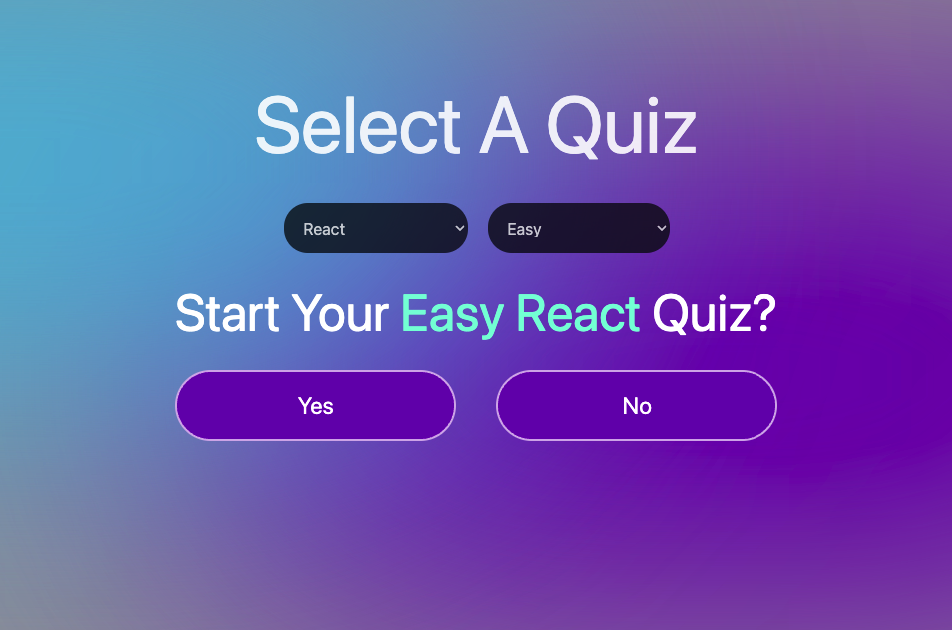
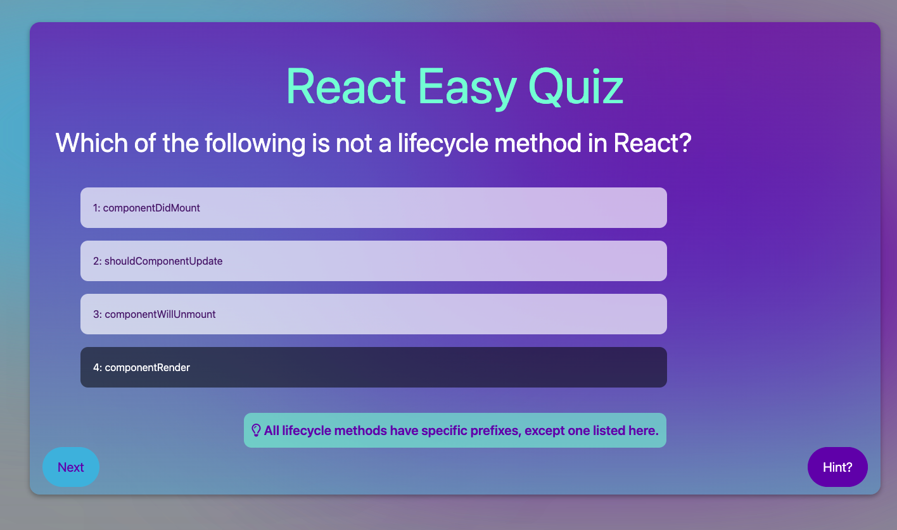
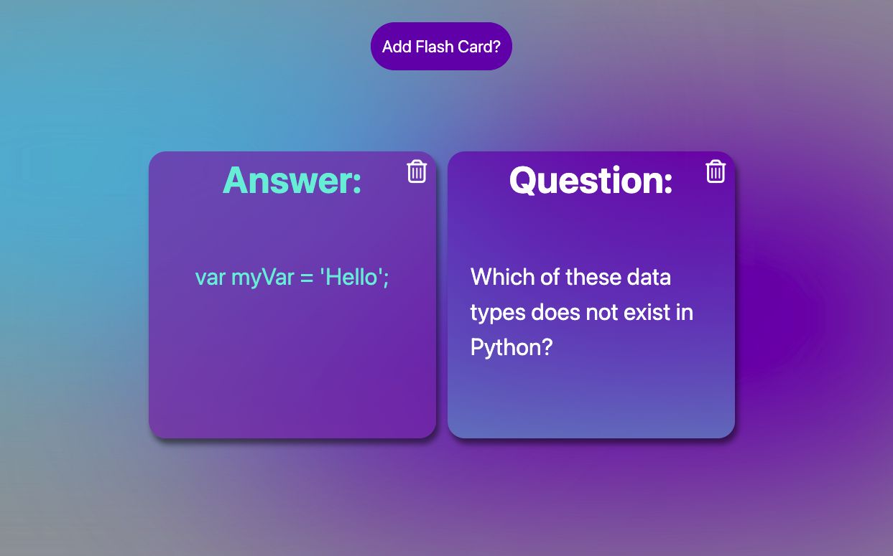

# TechTutor

TechTutor is intended to help developers further and or retain their knowledge on programming subjects by taking quizzes and creating flashcards. The app currently has three categories: JS, REACT, and Python.

---

## Screen Shots

Select a Quiz Page. Choose the category and difficulty.

Quiz questions. Get a hint or answer and hit next.

Flash Cards.

---

## Technologies Used

## Getting Started

Go to the link below, signup and begin your learning journey.

[live site](https://techtutor-3f12bdf80413.herokuapp.com/)

[Trello Board](https://trello.com/b/QKs10lmV/reactapp)

## Next Steps

- Add more questions and categories
- Refactor with TypeScript
- Add chat-gpt api to allow users to create personal categories
- Improve progress functionality, streak trackers, meaningful level ups
- Implement social sharing
- Improvements to styling
